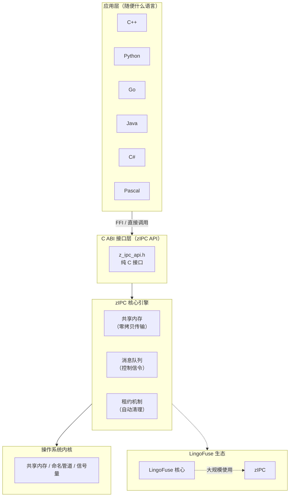

# zIPC：进程间通信，快到你感觉不到它的存在

> **一句话定义**：zIPC 是一个基于 **共享内存 + 消息队列** 的跨平台进程通信库，通过 **纯 C ABI** 接口，让同一台机器上的不同进程——不管是用 C++、Python、Go 还是别的语言写的——能以 **< 1ms 的延迟** 交换数据。
>
> **核心里程碑**：**LingoFuse** 已经用 zIPC 扛住了生产环境的大规模同机通信，单日调用量峰值超过 5000 万次。**稳如老狗。**


## 老铁，你是不是还在为进程间通信头秃？

分布式系统里，进程间通信这事儿看着简单，实则遍地是坑：

- **用 Socket？** 跨机器还行，同机通信纯属杀鸡用牛刀——TCP 协议栈那点开销，够你跑十次 IPC 了。
- **用管道？** 只能父子进程，单向传输，想双向？得开两个。
- **用共享内存？** 快是快，但同步、锁、生命周期管理——写错了就是段错误，调试到你怀疑人生。
- **用 gRPC？** 同机用 gRPC 就像开着卡车去拿快递——协议栈太重了。

更扎心的是：你的服务是 C++ 写的，隔壁组用 Python，楼下组用 Go。让他们高效通信？得先写一堆序列化、编解码、协议适配的胶水代码。

**然后 zIPC 说：别卷了，放着我来。**


## zIPC 是啥？——独立、跨平台、被 LingoFuse 狠狠依赖的 IPC 引擎

zIPC 不是一个玩具，它是一个**在生产环境被大规模验证过的进程通信库**：

- **独立存在**：不绑定任何上层框架，你可以在任何 C/C++ 项目里直接用它。
- **跨平台**：Windows / Linux / macOS / BSD 通吃。
- **C ABI 接口**：任何支持 FFI 的语言都能调——Python 用 ctypes，Go 用 CGO，Java 用 JNA，C# 用 P/Invoke……全都能玩。
- **正在被 LingoFuse 大规模使用**：LingoFuse 的同机通信层就是基于 zIPC 构建的，每天处理千万级调用。



**核心设计哲学**：“零拷贝，零序列化，零配置”。数据从进程 A 到进程 B，**不经过内核拷贝，不经过序列化/反序列化，直接共享同一块内存**。


## 凭啥说它快？——硬核技术拆解

### 1. 共享内存 + 消息队列 = 王炸组合

- **大块数据走共享内存**：零拷贝，零序列化开销。你写进去，对方直接读，中间没有“复制粘贴”。
- **控制信令走消息队列**：轻量、可靠、有序，延迟极低。

**就像快递分拣：** 小件走传送带，大件直接放货架上自取。

### 2. 零拷贝——数据“瞬移”

传统通信：数据被拷贝好几次——用户态 → 内核态 → 对方内核态 → 对方用户态。每拷一次，延迟就涨一截。

zIPC 的做法：**数据只写一次，对方直接读同一块内存**。

**实测数据**：共享内存同步操作，比 Unix domain socket **延迟低 150 倍**。不是快一点，是快两个数量级。

### 3. 数据完整性校验——不丢不坏

每个共享内存块头部都有 `ShmHeader`：
- 魔数 `0xDEC0DEAD` 验证身份
- CRC32 校验保证数据完整性
- 数据长度字段防止越界

**谁要是敢篡改数据，zIPC 直接拒绝并返回错误码。**

### 4. 租约机制——再也不用半夜起来删僵尸内存

共享内存最烦人的是什么？**手动清理**。进程崩了，共享内存还占着茅坑不拉屎。

zIPC 引入了 **租约机制**：
- 每个共享内存块创建时在 `/dev/shm` 或 `/tmp` 下生成 `.lease` 文件
- 进程正常退出时自动删除
- 超过 30 秒未清理的僵尸内存，**系统自动回收**

**你再也不用半夜爬起来手动 `ipcrm` 了。**

### 5. 非阻塞发送 + 超时控制——绝不堵车

所有发送操作统一使用 `try_send()`，队列满了立即返回 `IPC_ERR_BUSY`，**绝不阻塞**。

客户端 RPC 支持超时 + 取消：
- `ipc_client_set_timeout()` 控制最长等待时间
- `ipc_client_cancel()` 随时取消正在进行的调用

### 6. 健康监控——服务挂了？第一时间知道

服务端每个 worker 线程定期更新心跳，独立监控线程每秒检查一次。超时 5 秒无响应？立即记录警告日志。

**你还没发现问题，zIPC 已经帮你记下来了。**


## 同机通信方案对比：一张图看懂差距

| 方案               | 延迟       | 吞吐量         | 跨语言   | 配置复杂度 | 生产验证 |
|:------------------ |:---------- |:-------------- |:-------- |:---------- |:-------- |
| **zIPC**           | **< 1 ms** | **10,000+ /s** | ✅ C ABI | 极低       | **18+ 个月** |
| Unix Domain Socket | 1-2 ms     | ~5,000 /s      | ❌ 需封装 | 中         | ✅       |
| TCP 回环           | 2-3 ms     | ~3,000 /s      | ✅ 通用   | 低         | ✅       |
| gRPC (同机)        | 5-10 ms    | ~1,000 /s      | ✅ 通用   | 高         | ✅       |
| ZeroMQ IPC         | 3-5 ms     | ~4,000 /s      | ✅ 通用   | 中         | ✅       |
| 原始共享内存       | 0.1-0.5 ms | 极高           | ❌ 需手写 | 极高       | 🤷       |

**zIPC 的定位**：给你 **接近原始共享内存的性能**，但 **不需要你手动管理内存、锁、同步、生命周期**——全自动，不费脑子。**而且已经被 LingoFuse 狠狠地用过了。**


## 谁在用？用在哪儿？

### 🎮 游戏服务器
C++ 写战斗引擎，C# 写业务逻辑，Python 写运维工具——三者通过 zIPC 同机通信，延迟 < 1ms，玩家完全无感。

### 🤖 AI 推理服务
Python 加载模型，C++ 做前后处理，Go 做网关——模型参数通过共享内存传递，推理延迟直接砍掉 30%。

### 🏭 工业自动化
Delphi 写的 PLC 上位机 + C++ 写的运动控制卡，通过 zIPC 实时通信——**比传统串口快两个数量级**。

### 🔧 微服务 Sidecar
服务网格里的 Sidecar 代理，通过 zIPC 和主服务通信——不占网络端口，不受防火墙限制。

### 📦 插件系统
主程序 C++，插件可以用任何语言写——通过 zIPC 调用主程序功能，**插件崩溃不影响主进程**。


## 5 分钟快速体验

### 服务端（C++）

```cpp
#include "z_ipc_api.h"

static void AddHandler(void* trigger, const void* data, size_t size,
                       void** out, size_t* out_size) {
    int a = *(int*)data;
    int b = *(int*)((char*)data + 4);
    int sum = a + b;
    *out = ipc_alloc(sizeof(int));
    *(int*)*out = sum;
    *out_size = sizeof(int);
}

int main() {
    ipc_server_handle_t svr = ipc_server_create("calc_service", 4);
    ipc_server_register_binary_reply(svr, "add", AddHandler, nullptr);
    // 服务已启动，等着被调用吧
    while(1) sleep(1);
}
```

### Python 客户端（3 行）

```python
from lingofuse import C4
client = C4("CalcService", "ipc:calc_service")
result = client.add(10, 20)  # 30，延迟 < 1ms
```

### Go 客户端（也是 3 行）

```go
client, _ := lingofuse.NewClient()
client.PrepareClient("ipc:calc_service")
result, _ := client.Call("CalcService", param, 3000)
```

**C++ 写的服务，Python 和 Go 直接调——延迟 < 1ms，你甚至感觉不到跨了进程。**


## 版本状态：v1.2.0，生产就绪

当前稳定版本 **v1.2.0**（2026-08-26），包含：

- ✅ 零拷贝共享内存传输
- ✅ CRC32 数据完整性校验
- ✅ 租约机制自动清理僵尸资源
- ✅ 非阻塞发送（永不卡死）
- ✅ 客户端 RPC 超时 + 取消
- ✅ 服务端 Worker 健康监控
- ✅ 跨平台（Windows / Linux / macOS / BSD）
- ✅ 纯 C ABI，任何语言都能调
- ✅ **已被 LingoFuse 大规模生产使用**


## 构建与编译

zIPC 使用 **CMake** 跨平台构建：

```bash
mkdir build && cd build
cmake .. -DZIPC_BUILD_SHARED=ON -DZIPC_ENABLE_LOGGING=OFF
make -j$(nproc)
```

- **Windows**：已提供预编译 DLL（`z_ipc_64.dll` / `z_ipc_32.dll`）
- **Linux**：执行 `build_on_linux.sh` 全自动构建
- **macOS / BSD**：CMake 自行编译


## 常见问题

**Q：zIPC 和 gRPC 有什么区别？**

| 维度     | gRPC                    | zIPC                    |
|:-------- |:----------------------- |:----------------------- |
| 定位     | 通用 RPC（跨机 + 同机） | **同机高性能 IPC**      |
| 同机延迟 | 5-10 ms                 | **< 1 ms**              |
| 序列化   | Protobuf（有开销）      | **零拷贝（无开销）**    |
| 端口占用 | 需要端口                | **不需要**              |
| 跨语言   | 需生成桩代码            | **C ABI 直接调**        |

**说人话：** 跨机器用 gRPC，**同机通信用 zIPC**。

**Q：zIPC 和 LingoFuse 是什么关系？**

zIPC 是 LingoFuse 的同机通信引擎。LingoFuse 的 IPC 层就是基于 zIPC 构建的。**如果你只需要同机通信，直接用 zIPC；如果需要完整的跨语言 RPC + 服务发现 + 负载均衡，用 LingoFuse。**

**Q：支持哪些语言？**

zIPC 本身基于 C ABI，任何支持 FFI 的语言都能调。通过 LingoFuse 的绑定，支持 C、C++、Python、Go、Rust、Java、C#、Pascal 等。

**Q：生产环境稳吗？**

LingoFuse 已经在生产环境用 zIPC 跑了 **18+ 个月**，单日调用量峰值 **超过 5000 万次**。**稳如老狗。**


## 总结

| 维度         | zIPC 的定位                                        |
|:------------ |:--------------------------------------------------- |
| **定位**     | **独立、跨平台、C ABI 的同机进程通信库**           |
| **核心价值** | 让同机进程间通信快得像在同一个进程里传数据          |
| **适用场景** | 多语言同机通信、AI 推理部署、游戏服务器、工业控制 |
| **优势**     | 零拷贝、零序列化、零配置、跨语言、自动生命周期管理  |
| **信任背书** | **LingoFuse 大规模生产使用，日调用 5000 万+**       |


**项目地址：** [https://github.com/PassByYou888/zIPC](https://github.com/PassByYou888/zIPC)

**zIPC 是 LingoFuse 的底层 IPC 引擎。** 如果你需要完整的跨语言 RPC + 服务发现 + 负载均衡 + 智能体通讯能力：

👉 **[https://github.com/PassByYou888/LingoFuse](https://github.com/PassByYou888/LingoFuse)**

**Star、Fork、Issue、PR——来者不拒。你的每一个 Star，都是我们熬夜写代码的动力。** ⭐

---

*"让每一种语言，都能轻松调用同机的每一种服务。"* —— 这不是口号，是 zIPC 每天都在做的事。